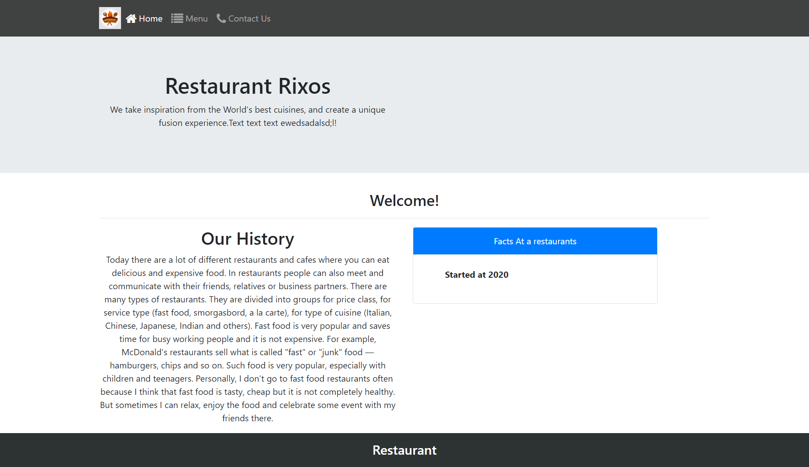

# React-Redux Project

## Description

Make a project with fetching API. Used react-thunk middleware for asynchronous requests to the external API, for receiving or saving data and react-redux to save states into the store. The project is a simple SPA with three navigation page with a unique route path.

### Install, Run and Build program

```
npm install

npm start

npm run build

```

### Testing
Testing is important part of projects. You can find test by this path: "src/__tests__".
Write following command to run tests:
```
npm test
```

## Live Demo

[Live Demo](https://reactcapstone.ansaryergesh.com)

## Built With

- React
- Redux
- Javascript ES6+
- Bootstrap 4

## Screenshot



## Future Features
- Make function for contact form to send feedback
- Include SASS for styling

## API

- To receive data used a ready-made [API](themealdb.com)

## Author:

👤 **Ansar Yergeshov**

- Github: [@ansaryergesh](https://github.com/ansaryergesh)
- Twitter: [@ansaryergesh](https://twitter.com/ansaryergesh)
- Linkedin: [Ansar Yergeshov](https://www.linkedin.com/in/ansaryergesh/)
- Gmail: yergeshovansar@gmail.com

## 🤝 Contributing

Contributions, issues and feature requests are welcome!

Feel free to check the [issues page](issues/).

## Show your support

Give a ⭐️ if you like this project!

## 📝 License

This project is [MIT](lic.url) licensed.
